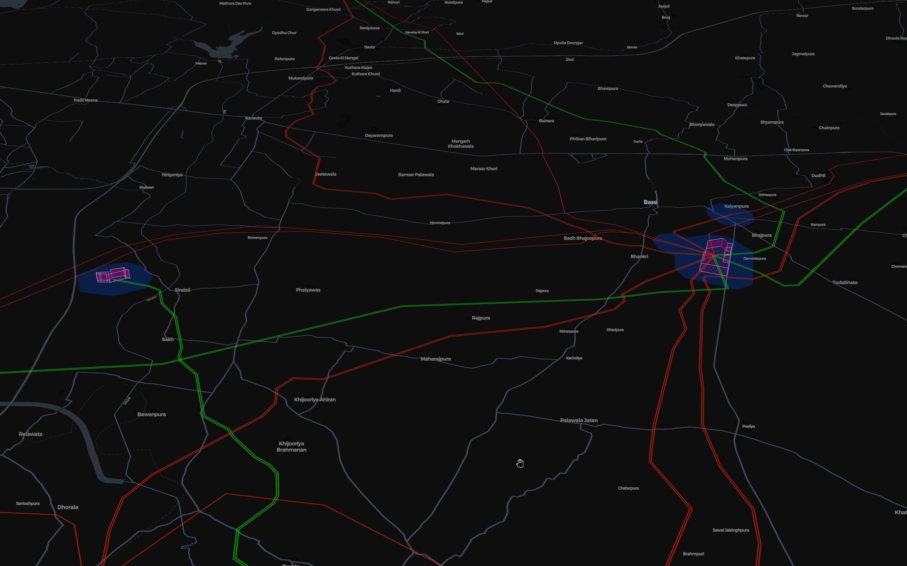

# grid-builder

A modular Snakemake workflow for retrieving OpenStreetMap power infrastructure.

<p align="center">
  
</p>

<p align="center">
  
</p>

## About

`grid-builder` is a modular `snakemake` workflow that retrieves OpenStreetMap power infrastructure and builds a generic high-voltage network. It can be imported into another `snakemake` workflow.

The workflow retains AC substations, overhead lines, and cables at configured voltage levels, then creates generic buses, connected line segments, and voltage-pair transformers. The outputs preserve OSM provenance and geometry but contain no PyPSA-specific line types, capacities, or electrical-component assumptions.

This module follows the Modelblocks conventions (https://www.modelblocks.org). For more information, consult the [integration example](./tests/integration/Snakefile) and the `snakemake` [modularisation documentation](https://snakemake.readthedocs.io/en/stable/snakefiles/modularization.html).

## Overview

Currently implemented:

1. Retrieve OSM substations, lines, cables, and (optionally) circuit relations by country, either from a cached local Geofabrik PBF extract or the live Overpass API.
2. Clean the raw retrieval output, filtering voltage, frequency, construction status, and future assets, and grouping relation member ways into one line per real-world circuit.
3. Merge nearby stations and line endpoints into generic buses, AC lines, and transformers.
4. Build a self-contained interactive map of the resulting network (`map.html`), with layer toggles, voltage/text filtering, and click-through OSM links — this is the workflow's default target.

## Configuration

Configuration lives in [`config/config.yaml`](./config/config.yaml), validated against a generated JSON schema. See the configuration [README](./config/README.md) for the available controls, including retrieval backends, regional overrides, and personal/local settings.

## Input / output structure

Please consult the [interface file](./INTERFACE.yaml) for more information.

Raw retrieval outputs use `<resources>/retrieve/{country}_{feature}.json`, one
file per country and feature (`lines_way`, `cables_way`, `substations_way`,
`substations_node`, `substations_relation`, `routes_relation`). Both retrieval
backends write the same raw-Overpass-JSON shape, so downstream cleaning doesn't
need to know which one ran. Clean features use `<resources>/clean/*.geojson`;
generic network components use `<resources>/build/csv/{buses,lines,transformers}.csv`
and matching GeoJSON files under `<resources>/build/geojson/`, which also
includes `stations_polygon.geojson` (clustered station shapes) and
`buses_polygon.geojson` (substation polygons scoped to the buses in the output).
An interactive map of the network is written to `<resources>/map.html`; it is
a standalone HTML file (no server required) and the workflow's default target.
Country logs use `<logs>/retrieve_osm_pbf/{country}.log` or
`<logs>/retrieve_osm_overpass/{country}.log`, depending on `retrieve.source`. The
integration example sets these roots to `resources/grid-builder` and
`logs/grid-builder`. Downloaded PBF files (used for `retrieve.source: geofabrik`)
are cached in `data/earth-osm` in this checkout.

DC assets (links, converters, switching stations) are out of scope: this workflow
builds a generic AC topology only, with no PyPSA-specific line types or capacities.

## Development

We use [`pixi`](https://pixi.sh/) as our package manager for development.
Once installed, run the following to clone this repository and install all dependencies.

```shell
git clone git@github.com:PyPSA/grid-builder.git
cd grid-builder
pixi install --locked
```

For testing, simply run:

```shell
pixi run --locked lint
pixi run --locked test
```

To test a minimal example of a workflow using this module:

```shell
pixi shell                          # activate this project's environment
cd tests/integration/               # navigate to the integration example
snakemake --use-conda --cores 2      # run the workflow!
```

The Pixi environment supplies Snakemake and the configuration-validation
dependencies. Snakemake installs the retrieval script's dependencies from
`workflow/envs/retrieve.yaml` when `--use-conda` is enabled. A consuming workflow
must also provide the host dependencies from `pixi.toml`; importing the module
does not activate its Pixi environment automatically.

The integration test uses a fresh temporary output directory, runs the retrieval,
cleaning, and generic network Conda environments, and checks the resulting
components and country logging. It needs internet access on the first run to
install dependencies and download Benin's OSM extract; subsequent runs can reuse
those caches. Test logs are retained in `tests/integration/logs`.

Each retrieval job runs with one worker (`threads: 1`), so CPU allocation stays
entirely under Snakemake's control. Snakemake can still run multiple country jobs
in parallel using `--cores`.

If this checkout is moved and commands fail with a `bad interpreter` error,
rebuild the installed environment with `pixi reinstall --locked`.

## License

`grid-builder` is released as free software under the [MIT](LICENSE) license. Different licenses and terms of use may apply to input data, e.g. OpenStreetMap data is subject to the [Open Database License](https://opendatacommons.org/licenses/odbl).

## References & related work

* Jonas Hörsch et al. 2018. PyPSA-Eur: An open optimisation model of the European transmission system, *Energy Strategy Reviews*, Volume 22. https://doi.org/10.1016/j.esr.2018.08.012
* Maximilian Parzen et al. 2023. PyPSA-Earth: A new global open energy system optimization model demonstrated in Africa, *Applied Energy*, Volume 341. https://doi.org/10.1016/j.apenergy.2023.121096
* Bobby Xiong et al. 2025. Modelling the high-voltage grid using open data for Europe and beyond. *Sci Data* 12, 277. https://doi.org/10.1038/s41597-025-04550-7
