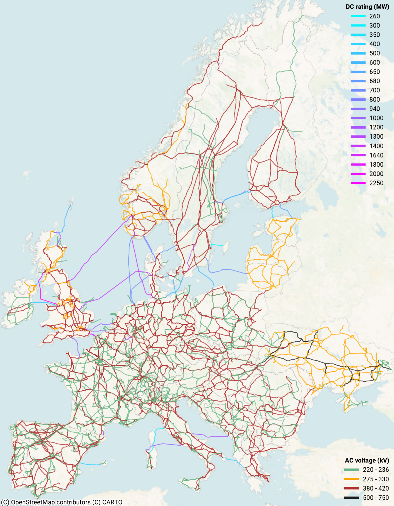

# grid-builder

A modular Snakemake workflow for constructing and validating power grid models using OpenStreetMap data.

<p align="center">
  
</p>

## About

`grid-builder` is a modular `snakemake` workflow for constructing power grid models from OpenStreetMap data for use in energy system modelling. It can be imported directly into any `snakemake` workflow.

Starting from raw OpenStreetMap data, the workflow extracts high-voltage grid components, including substations, transmission lines, cables, transformers, and converters. Missing electrical parameters such as voltage levels and line counts are then inferred heuristically using region-specific assumptions on asset types and standards. The output is a model-ready power grid network compatible with [PyPSA-Eur](https://github.com/PyPSA/pypsa-eur), [PyPSA-Earth](https://github.com/PyPSA/pypsa-earth), and other energy system modelling frameworks.

This module follows the Modelblocks conventions (https://www.modelblocks.org). For more information, consult the [integration example](./tests/integration/Snakefile) and the `snakemake` [modularisation documentation](https://snakemake.readthedocs.io/en/stable/snakefiles/modularization.html).

## Overview

Data processing steps:

1. Download OSM power infrastructure data
2. Clean and infer electrical network attributes
3. Build connected network topology
4. Validate network model

## Configuration

<!-- Please describe how to configure this module below -->

Please consult the configuration [README](./config/README.md) and the [configuration example](./config/config.yaml) for a general overview on the configuration options of this module.

## Input / output structure

<!-- Please describe input / output file placement below -->

Please consult the [interface file](./INTERFACE.yaml) for more information.

## Development

<!-- Please do not modify this templated section -->

We use [`pixi`](https://pixi.sh/) as our package manager for development.
Once installed, run the following to clone this repository and install all dependencies.

```shell
git clone git@github.com:PyPSA/grid-builder.git
cd grid-builder
pixi install --all
```

For testing, simply run:

```shell
pixi run test-integration
```

To test a minimal example of a workflow using this module:

```shell
pixi shell                          # activate this project's environment
cd tests/integration/               # navigate to the integration example
snakemake --cores 2                 # run the workflow!
```

## License

`grid-builder` is released as free software under the [MIT](LICENSES/MIT.txt) license. Different licenses and terms of use may apply to input data, e.g. OpenStreetMap data is subject to the [Open Database License](https://opendatacommons.org/licenses/odbl).

## References & related work

* Jonas Hörsch et al. 2018. PyPSA-Eur: An open optimisation model of the European transmission system, *Energy Strategy Reviews*, Volume 22. https://doi.org/10.1016/j.esr.2018.08.012
* Maximilian Parzen et al. 2023. PyPSA-Earth: A new global open energy system optimization model demonstrated in Africa, *Applied Energy*, Volume 341. https://doi.org/10.1016/j.apenergy.2023.121096
* Bobby Xiong et al. 2025. Modelling the high-voltage grid using open data for Europe and beyond. *Sci Data* 12, 277. https://doi.org/10.1038/s41597-025-04550-7
