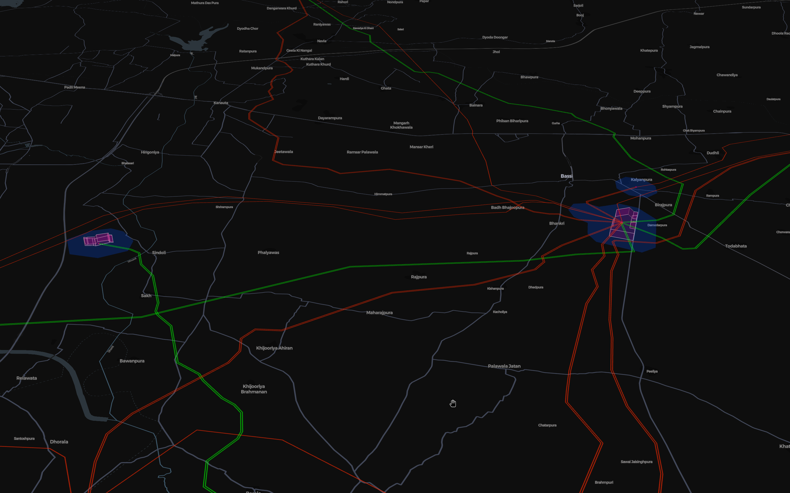
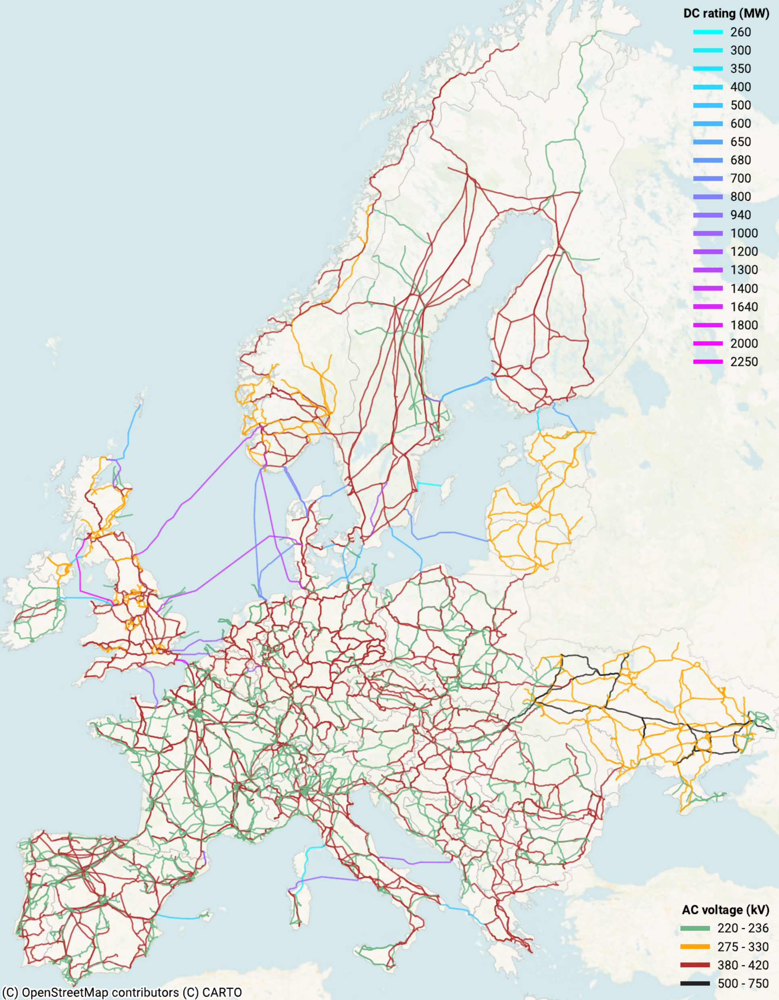

# grid-builder

A modular Snakemake workflow for retrieving OpenStreetMap power infrastructure.

<p align="center">
  
</p>

<p align="center">
  
</p>

## About

`grid-builder` is a modular Snakemake workflow for retrieving OpenStreetMap power
infrastructure and building a generic high-voltage AC network. It follows the
[Modelblocks conventions](https://www.modelblocks.org/convention/) and can be
imported into another Snakemake workflow or run on its own.

For more information, consult the [Modelblocks documentation](https://modelblocks.readthedocs.io/en/latest/),
the [integration example](./tests/integration/Snakefile), and the
[Snakemake modularisation documentation](https://snakemake.readthedocs.io/en/stable/snakefiles/modularization.html).

## Overview

<p align="center">
  
</p>

The rule graph shows the default Geofabrik backend. Selecting Overpass replaces
`retrieve_osm_pbf` with `retrieve_osm_overpass`; the downstream rules are the same.

Data processing steps:

1. Retrieve OSM substations, overhead lines, cables, and optional circuit
   relations by country, using Geofabrik PBF extracts or the Overpass API.
   Downloaded PBF extracts are cached for reuse.
2. Clean tags and geometries, filter by voltage and frequency, and combine
   circuit relation member ways when enabled.
3. Apply the configured construction-status and date filters, merge nearby
   stations and line endpoints into buses, and construct AC lines and
   transformers between voltage levels at the same station.
4. Generate an interactive HTML map with layer controls, voltage and text
   filters, and links to the source OSM objects. This is the default target
   when running the workflow on its own.

### Important assumptions

- The workflow builds AC topology for now, DC lines and converters will be
  added at a later stage.
- Connections are inferred from geometry and OSM tags. Transformers are inferred
  between every pair of voltage-level buses at the same real station, rather
  than taken from an inventory of individual transformers.
- Outputs include geometry and OSM references for buses and lines.
- The map embeds the network data in an HTML file that opens without a local
  server. Its JavaScript libraries and basemap require internet access.

## Configuration

Consult the [configuration README](./config/README.md) and
[default configuration](./config/config.yaml) for retrieval options, network
settings, regional overrides, and local configuration.

Configuration is validated with Pydantic. The same models generate the
[JSON Schema in YAML format](./workflow/internal/config.schema.yaml) describing
the available options.

## Input / output structure

No user-supplied data files are required; the workflow retrieves OSM data for
the configured countries. Each public output has a pathvar documented in the
[interface file](./INTERFACE.yaml).

Main outputs:

| Output | Default location |
| --- | --- |
| Network CSVs | `<results>/network/csv/{buses,lines,transformers}.csv` |
| Network GeoJSONs | `<results>/network/geojson/*.geojson` |
| Interactive map (default target) | `<results>/map.html` |

Network GeoJSONs include the three network components plus
`stations_polygon.geojson` and `buses_polygon.geojson`.

Both retrieval backends write raw OSM JSON files to
`<resources>/automatic/retrieve/{country}_{feature}.json`, where `country` is an
identifier from the configured `countries`. The six feature names are: `lines_way`,
`cables_way`, `substations_way`, `substations_node`, `substations_relation`, and
`routes_relation`.

Cleaning intermediates use `<resources>/automatic/clean/`. Downloaded PBFs are
cached in `<resources>/automatic/earth-osm/` inside the consuming workflow's
working directory. Logs use `<logs>/`, with a separate retrieval log per country.

### Importing into another workflow

The host environment needs Python 3.12, Snakemake >=9.27, `pydantic >=2`,
`ruamel.yaml >=0.18`, `pyyaml >=6,<7`, and `earth-osm >=3.0.2` to load and validate
the module. Rule dependencies are installed separately by `--use-conda`.

Create `config/modules/grid_builder.yaml` with the module configuration:

```yaml
grid_builder:
  countries: [BE]
  retrieve:
    source: geofabrik
```

Then import the module in your Snakefile:

```python
configfile: "config/modules/grid_builder.yaml"

module grid_builder:
    snakefile:
        github(
            "pypsa/grid-builder",
            path="workflow/Snakefile",
            tag="<release-or-commit>",
        )
    config:
        config["grid_builder"]
    pathvars:
        logs="logs/grid-builder",
        resources="resources/grid-builder",
        results="results/grid-builder",
        # Optional: rewire an individual result for a downstream module.
        buses="results/shared/buses.csv",

use rule * from grid_builder as grid_builder_*

rule all_grid_builder:
    default_target: True
    input:
        rules.grid_builder_build_interactive_map.output,
```

Run `snakemake --use-conda --cores 2 all_grid_builder`. Replace the tag
placeholder with the published release or commit you want to use. For a local
checkout, replace `github(...)` with the path to its `workflow/Snakefile`.

Use the output pathvars in [INTERFACE.yaml](./INTERFACE.yaml) to rewire network
files and the map. Retrieval intermediates can also be redirected: set
`osm_retrieve` to change their directory, or set an individual pathvar such as
`osm_lines_way="raw/{country}/lines.json"`. The six retrieval pathvars are
`osm_lines_way`, `osm_cables_way`, `osm_substations_way`, `osm_substations_node`,
`osm_substations_relation`, and `osm_routes_relation`.

Retrieval-only consumers can request `rules.grid_builder_retrieve_osm_all.input`
regardless of where those files are stored. Referencing imported rule outputs
avoids hard-coding their locations.

## Development

We use [Pixi](https://pixi.sh/) to manage dependencies. Clone the repository and
install the development environment:

```shell
git clone https://github.com/pypsa/grid-builder.git
cd grid-builder
pixi install --locked
```

This is a multi-environment project; see [pixi.toml](./pixi.toml):

- `default`: development, validation, and testing tools, including the execution
  dependencies needed by unit tests.
- `module`: execution dependencies used by Snakemake rules.

After changing dependencies, update the lock file and export the execution
environment for module users:

```shell
pixi lock
pixi run --locked export-snakemake-env module
```

This writes `workflow/envs/module.yaml` and package pins from `pixi.lock` for
Linux (`linux-64`), macOS (`osx-arm64`), and Windows (`win-64`). The export command
also accepts an optional output directory after `module`.

To regenerate the default configuration, schemas, and regional-file index after
changing the Pydantic models or adding or removing regional config files:

```shell
pixi run --locked generate-config
```

## Testing

Run the checks and test suite:

```shell
pixi run --locked lint
pixi run --locked test
```

The suite covers configuration validation, network processing, local and HTTP
module imports, output rewiring, and environment consistency. Remote-import
tests use synthetic OSM data and a local mock Overpass server.

The live integration test retrieves Benin's OSM extract and runs the workflow
in its exported Conda environment. It requires internet access for the data
and, on the first run, environment installation. Conda environments are cached
between runs. Test logs are retained in `tests/integration/logs`.

To run only the integration checks:

```shell
pixi run --locked test-integration
```

To run the example consuming workflow manually:

```shell
pixi shell
cd tests/integration/
snakemake --use-conda --cores 2
```

## License

`grid-builder` is released as free software under the [MIT](LICENSE) license. Different licenses and terms of use may apply to input data, e.g. OpenStreetMap data is subject to the [Open Database License](https://opendatacommons.org/licenses/odbl).

## References & related work

* Jonas Hörsch et al. 2018. PyPSA-Eur: An open optimisation model of the European transmission system, *Energy Strategy Reviews*, Volume 22. https://doi.org/10.1016/j.esr.2018.08.012
* Maximilian Parzen et al. 2023. PyPSA-Earth: A new global open energy system optimization model demonstrated in Africa, *Applied Energy*, Volume 341. https://doi.org/10.1016/j.apenergy.2023.121096
* Bobby Xiong et al. 2025. Modelling the high-voltage grid using open data for Europe and beyond. *Sci Data* 12, 277. https://doi.org/10.1038/s41597-025-04550-7

## Contributors

See [AUTHORS](./AUTHORS) for copyright attribution and the
[contributor list](https://github.com/pypsa/grid-builder/graphs/contributors)
for contributions to the project.
